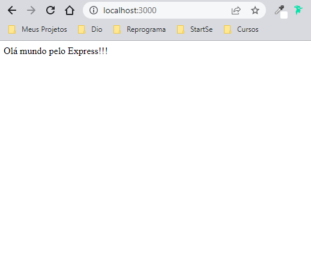
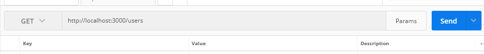
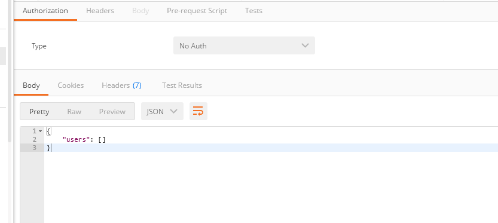
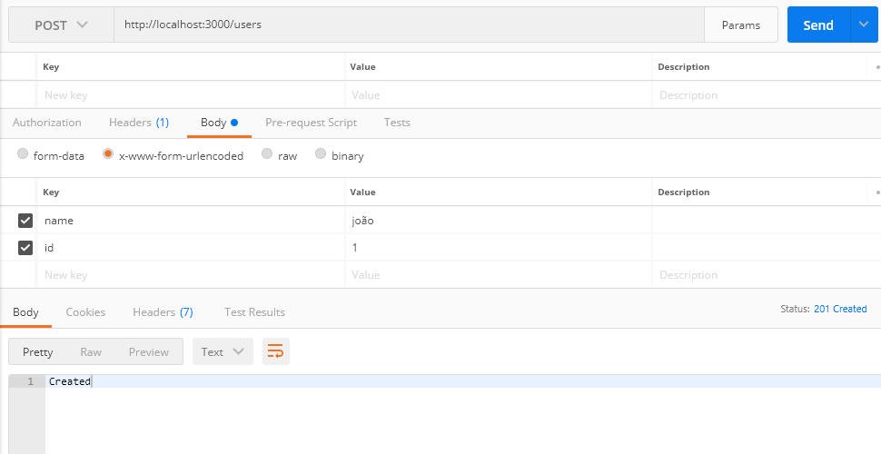
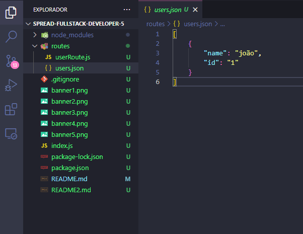
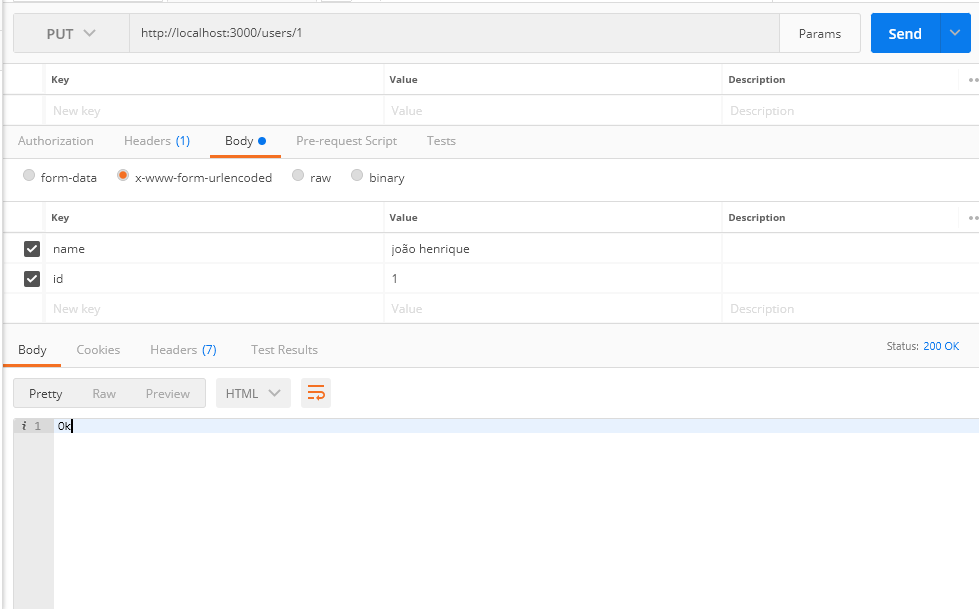
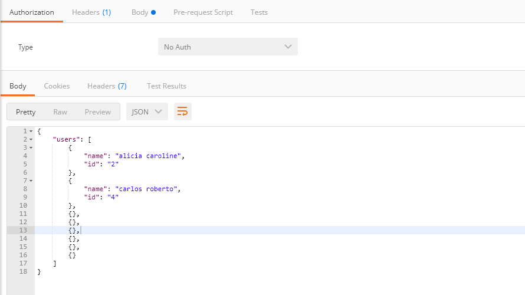
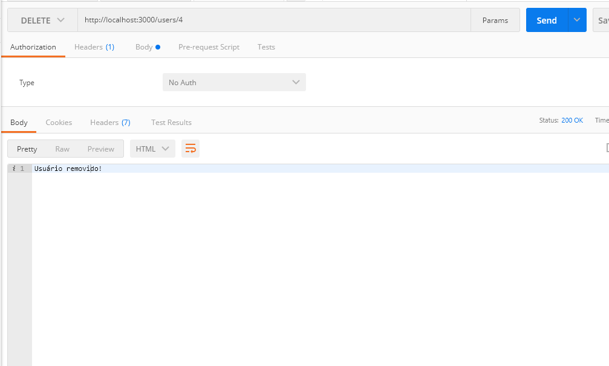
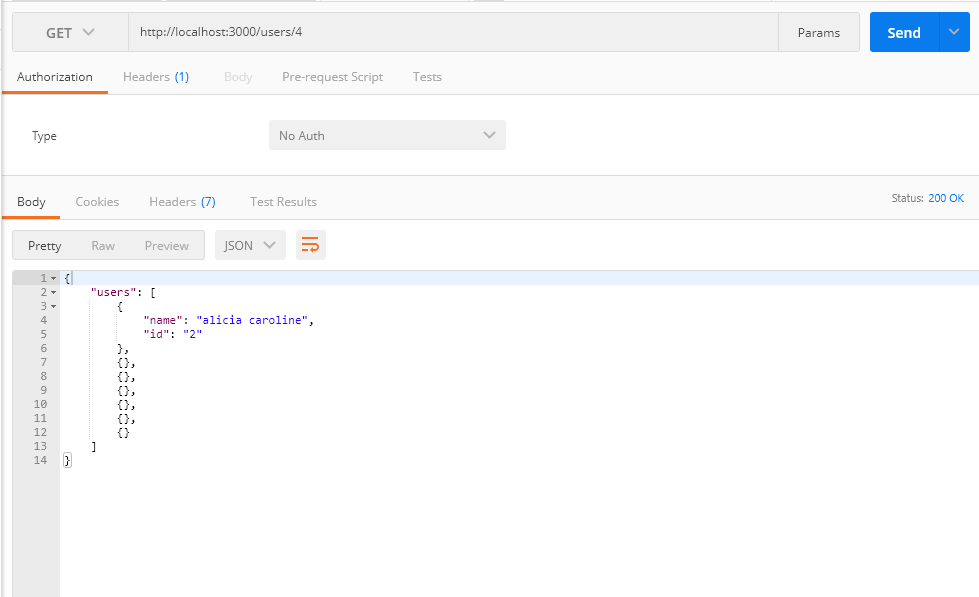

## Introdução ao Node.js com **Express**

# 👉 [`1 ` - Instalando o **Express**](#👉-1----instalando-o-express)

#### No terminal digite

```npm
npm install express --save
```

#### Depois de instalado, ele cria a pasta `node_modules`, onde contém todas as bibliotecas que o **Express** utiliza. Cria também o arquivo `package-lock.json` onde terão os arquivos do projeto.


#### Criar o arquivo de configuração

```npm
npm init
```
#### Vai criar o arquivo de configuração


#### Digite novamente o comando abaixo

```npm
npm install express --save
```
#### Pra ele adicionar as dependência do **Express** no projeto


#### No arquivo *index.js*

**Se não tiver um arquivo com esse nome, crie um**

```javascript
index.js
```
#### Criaremos um script.

___
# 👉 [`2 ` - Criando um *script*]()

#### Criar uma variavel para chamar a funcão `require` que receberá o **Express**.
```javascript 
const express = require('express');
```
#### Criar uma variavel para chamar a função **Express**.
```javascript 
const app = express(); 
```
#### Criar uma variavel para criar a porta.
```javascript 
const port = 3000; 
```
#### Chamamos o app para conectar a porta indicada e mostrar no console a mensagem.
```javascript 
app.listen(port, () => console.log('Api rodando na porte 3000'))
```
#### No terminal digite o comando 
```npm
npm init
```
#### Depois execute o arquivo no terminal
```node.js
node index.js
```
#### Se a mensagem aparecer no console, o servidor está funcionando.
```npm
$ node index.js
Api rodando na porte 3000
```

______
# 👉 [`3 ` - Colocando um *endpoint* para fazer um teste]()

```javascript
app.get('/', (req, res) => res.send('Olá mundo pelo Express!'))
```
#### O `app.get` é o método *HTTP* que será testado , `/` é o root da *Url* da nossa aplicação, `(req, res)` função com dois parâmetros, `req` tem os dados da requisição, `res` é o responsável por resolver ou responder a requisição, `res.send` enviará a requisição, `('Olá mundo pelo Express!')` é a requisição em si.


#### Depois execute o arquivo no terminal
```node.js
node index.js
```

#### ou abra no navegador 

```
localhost:3000
```

#### A mensagem aparecerá no navegador
  <p align="center">
    
  </p>

______
# 👉 [`4 ` - Criar uma **endpoint** para users **(/users)** utilizando os métodos:]()

 
#### => `GET` - Listar usuários 
#### => `POST` - Criar usuário 
#### => `PUT` - Modificar usuários 
#### => `DELETE` - Remover usuários 


#### Criar uma pasta chamada `routes` => Que seriam as rotas da nossa aplicação

#### Criar um arquivo chamado `userRoutes` => Será a rota dos usuários. Ir no arquivo index.js e importar a rota

```javascript
const userRoute = require('./routes/userRoute');
```
#### Criar uma variavel que recebe a requisição do arquivo `('./routes/userRoute')`. No arquivo `userRoute.js` importar o `fs` (*fail system*).

```javascript
const fs = require('fs');
```

#### `fs` Módulo nativo do **Javascript** para lidar com arquivos e sistemas. Vamos usar o `join`
```javascript
const { join } = require('path');
```
#### Para lidar com pastas de arquivos.
```javascript
const filePath = join(__dirname, 'users.json');
```

#### `join(__dirname, 'users.json')` caminho pra um arquivo que será um arquivo JSON pra simular a interação com banco de dados, `join` junção, `__dirname`  do diretório da rota de usuários e `'users.json'`  arquivo.

______
# 👉 [`5 ` - Método para Listar Usuário]()

```javascript
const getUsers = () => {
    const data = fs.existsSync(filePath);
    ? fs.readFileSync(filePath)
    : [];

    try {
        return JSON.parse(data);
    } catch (error) {
        return [];
    }
}
```
#### Criando uma função chamada `getUsers` pegar os usuários que estarão armazenados no arquivo, `const data = fs.existsSync(filePath);` criamos uma variavel `const data` que será responsável de chamar o fs `fs.existsSync` pra verificar se o arquivo `(filePath)` existe, `fs.readFileSync(filePath);` veremos `fs.readFileSync` esse arquivo `(filePath)` se `?` existir, `: [];` Senão existir `:` nos retornará um array vazio `[]`.


```javascript
try {
        return JSON.parse(data);
    } catch (error) {
        return [];
    }
```

#### Se tudo der certo até aqui, ele retornará um `try { return JSON.parse(data); }`, Se der errado, `catch (error) { return []; }` retornará um array vazio.

______
# 👉 [`6 ` - Método para Salvar Usuário]()

```javascript
const saveUser = (users) => fs.writeFileSync(filePath, JSON.stringify(users, null, '\t'))
```
#### A variável `const saveUser` vai receber uma função que receberá os dados dos usuários `= (users) =>` que vai escrever o arquivo `fs.writeFileSync`, nome do arquivo `(filePath,` transformando em `JSON.stringify`, e adicionar uma outra configuração adicionando um objeto `(users,` , não querer nenhum outro parâmetro ` null,` e tabular esses dados com tag `'\t'))`.

______
# 👉 [`7 ` - Criando a Função **userRoute** e o Método **GET**]()

```javascript
const userRoute = (app) => {
    app.route('/users/:id?') 
    .get((req, res) => {
        const users = getUsers();

        res.send({ users })
    })
}
```

#### Criada uma variavel `const userRoute` que recebe uma função que receberá o app `= (app) =>` usando o app para criar uma rota `app.route` que vai cuidar de todas as outras rotas(**POST, GET, PUT, DELETE**) `('/users/` usando como parâmetro opcional o id `:id?')`, criando o primeiro método `.get` que recebe os parâmetros `((req, res)` **require e response**, lendo a função `const users = getUsers();` retornando uma resposta  `res.send({ users })` para usuarios.

______
# 👉 [`8 ` - Testando...]()

```javascript
module.exports = userRoute;
```

#### Exportando o módulo para utilizar externamente.
______
# 👉 [`9 ` - No index.js para usar a função criada]()

```javascript
userRoute(app)
```

#### No arquivo **index.js**, usar a função `userRoute` e passar como dependência o app `(app)` que é a nossa aplicação.
______
# 👉 [`10 ` - Utilizando o Postman para testar]()

#### Abra o Postman
**Se voce não tiver ele instalado na máquina poderá usar a versão para navegador**

#### No terminal aperte `ctrl-c` para parar o servidor e na sequência execute o arquivo no terminal novamente
```node.js
node index.js
```
#### No Postman deverá estar assim
  <p align="center">
    
  </p>

#### Clique em send e apareceá a resposta:
  <p align="center">
    
  </p>

#### Neste caso retornou um array vazio porque ainda não criamos o arquivo JSON que manterá os dados dos usuários e no passo `5 ` que criamos a condição do try catch seria que no caso de der errado(neste caso por conta de não ter os dados) nos retornaria um array vazio, estão esta funcionando nossa aplicação
______
# 👉 [`11 ` - Criando o método **POST**]()
```javascript
.post((req, res) => {
        const users = getUsers();

        users.push(req.body);
        saveUser(users);

        res.send(201).send('Ok');
})
```
#### O `.post` é de criação de usuários, usando uma função que chama os parâmetros `((req, res) =>` buscando os usuários `const users =` que temos no arquivo `= getUsers();` pegando o objeto (que é um array) `users` inserindo `.push` um novo registro no objeto `(req.body);` que é exatamente o corpo da requisição dos campos que estamos enviando ao formulário, usando a função `saveUser` que vai usar o objeto atualizado `(users);`, mandando uma resposta `res.send` com status `(201)`, escrevendo ok `('Ok');` que o usuário foi criado.

#### pra poder transformar esses dados criando o cabeçalho da requisição HTTP em um objeto para receber esse body `body`, temos que chamar um outro middeware para o express que são que são funções que podemos utilizar o projeto que é o body-parser `body-parser`, temos que ir no arquivo index.js e importar ele.
```javascript
const bodyParser = require('body-parser');
```
#### falando para o Node.js que vamos usar o meddleware 
```javascript
app.use(bodyParser.urlencoded({ extended: false}));
```
#### o `app.use` e o `(bodyParser.urlencoded` que é pra fazer a transformação do dado do metodo post em objeto pra termos disponível no `req.body`, passando os parâmetros `({ extended: false}));` na função, agora estaremos aptos a receber as informações atavés do formulário.

#### No terminal aperte `ctrl-c` para parar o servidor e na sequência execute o arquivo no terminal novamente
```node.js
node index.js
```
#### Clique em send e apareceá a resposta:
  <p align="center">
    
  </p>

### no body apareceu como status `Created`, ou seja, foi criado o usuário. Para confirmar, verifique que no VSCode foi criado um arquivo `users.json`, nele estão as informações do usuário criado.
  <p align="center">
    
  </p>

______
# 👉 [`12 ` - Atualizando os usuários, Método **PUT**]()
```javascript
.put((req, res) => {
        const users = getUsers()

        saveUser(users.map(user => {
            if (user.id === req.params.id) {
                return {
                    ...user, ...req.body
                }
            }

            return user;
        }))
        res.status(200).send('Ok');
    })
```
#### O `.put` é a atualização de usuários, usando uma função que chama os parâmetros `((req, res) =>` buscando os usuários `const users =` que temos no arquivo `= getUsers();`, usando a função `saveUser` e a função `(users.map` pra criar um novo objeto atualizando o usuário que estamos passando o id `(user => `, se o usuário atual `if (user.id ` for igual ao parâmetro `=== req.params.id)` vai retornar um objeto `return { ...user,` com o usuário atual mesclando com o que ja temos ` ...req.body }`, senão retorna o usuário atual somente ` return user;`. Após retorna um status `res.status(200)` com a mensagem `.send('Ok');`.
#### No terminal aperte `ctrl-c` para parar o servidor e na sequência execute o arquivo no terminal novamente
```node.js
node index.js
```
#### Clique em send e apareceá a resposta:
  <p align="center">
    
  </p>

### no body apareceu como status `Ok`, ou seja, foi alterado o usuário. Para confirmar, verifique o arquivo `users.json`.
______
# 👉 [`13 ` - Deletando usuários, Método **DELETE**]()
```javascript
.delete((req, res) => {
        const users = getUsers();

        saveUser(users.filter(user => user.id !== req.params.id))


        res.status(200).send('Ok')
    })
```
#### O `.delete` é a exclusão de usuários, usando uma função que chama os parâmetros `((req, res) =>` buscando os usuários `const users =` que temos no arquivo `= getUsers();`, usando a função `saveUser` e a função `users.filter` que filtrará somente os usuários `(user =>` com id `user.id` diferente do `!== req.params.id))` que foi passado na requisição, ou seja, vai salvar todos os usuários mesno o que foi passado no método delete, retornando um status `res.status(200)` com uma mensagem `.send('Ok')`.

#### No terminal aperte `ctrl-c` para parar o servidor e na sequência execute o arquivo no terminal novamente
```node.js
node index.js
```
#### Tenho dois usuários e, no caso, vou deletar o segundo (id: 4):
  <p align="center">
    
  </p>

#### no body apareceu como status `Usuário removido`, ou seja, foi excluido.
  <p align="center">
    
  </p>

#### Agora so for no método GET, só exibirá um usuário.
  <p align="center">
    
  </p>


